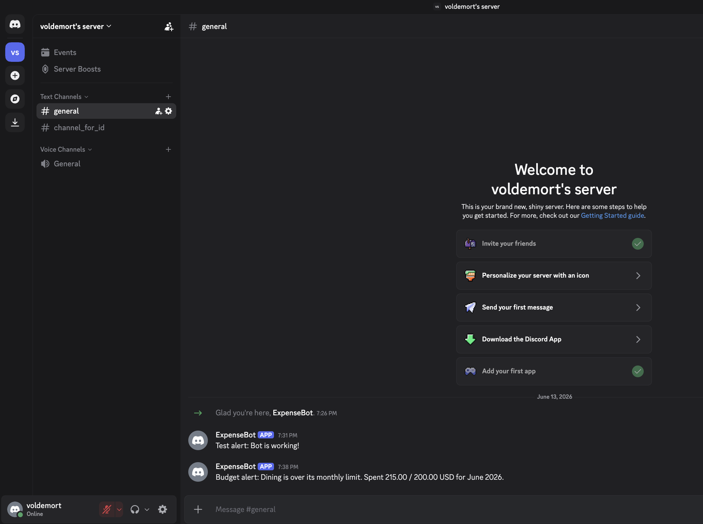

# Expense Tracker API — Intern Screening

A small Django REST Framework backend for tracking personal spending (categories, expenses, date filtering, and a per-category summary).

## Your Task (read this first)

You will work with this codebase in four stages:

1. **Fix 5 bugs.** The code contains **5 intentional bugs**. Find and fix them all. Every hint you need is in the codebase or in this file.
2. **Add Authentication (required).** Scope expenses and categories to the logged-in user and protect the endpoints.
3. **Build 2 integration features (required):** Currency conversion and Budget threshold bot alerts. Both are specified in detail below, with example requests/responses — these are the hard part.
4. **Add 2 optional features** of your choice (list below).

Config placeholders for stage 3 are already in `.env.example` — copy them into your `.env`.

Full rules, branch naming, and submission details are in requirements at the bottom. Read that **before** writing code — workflow is graded.

## What you've been given

| File / Dir | What it is |
|---|---|
| `expenses/` | The app: `models.py`, `serializers.py`, `views.py`, `urls.py`, `tests.py` |
| `config/` | Django project settings and root URL config |
| `postman_collection.json` | Ready-to-import Postman collection — every endpoint. Use it to test and hunt bugs. |
| `.env.example` | Template for your `.env` |
| `pyproject.toml` | Dependencies (managed by `uv`) |
| `manage.py` | Django entry point |

## Setup (3 commands)

Uses [uv](https://docs.astral.sh/uv/). Prefix every `manage.py` call with `uv run`.

```bash
uv sync
cp .env.example .env
uv run python manage.py migrate
uv run python manage.py runserver
```

## Test the endpoints

1. Import `postman_collection.json` into Postman.
2. The `base_url` variable is preset to `http://127.0.0.1:8000`.
3. Run each request against your local server.

## Endpoints

| Method | Endpoint | Description |
|---|---|---|
| GET | `/api/categories/` | List all categories |
| POST | `/api/categories/` | Create a category |
| GET | `/api/expenses/` | List expenses (filter with `?start_date=` and `?end_date=`, inclusive) |
| POST | `/api/expenses/` | Create an expense |
| GET | `/api/expenses/{id}/` | Retrieve one expense |
| PUT | `/api/expenses/{id}/` | Update an expense |
| DELETE | `/api/expenses/{id}/` | Delete an expense |
| GET | `/api/expenses/summary/` | Total spent per category (converted to BASE_CURRENCY) |
| GET | `/api/expenses/monthly-summary/` | Total spent grouped by month |

## Tech stack

Python 3 · Django 5 · Django REST Framework · SQLite · python-dotenv

---

## Full Requirements

### Git workflow (graded)

- Create a new repo under **your** GitHub account.
- Default branch **must be named `trunk`** (not `main`/`master`).
- One branch + one PR per item: bug fixes go to `fix/<bug-name>`, features go to `feature/<feature-name>`.
- **Never commit fixes or features directly to `trunk`.** Merge via PR.
- Do **not** squash. Keep a clean, atomic, readable history. Push regularly.
- Each commit message must say what changed and why.

### Required features

**Authentication** — expenses and categories owned by and scoped to the authenticated user; endpoints protected (token/session auth + login).

#### Feature 1 — Currency conversion

- Add a `currency` field to expenses (ISO code, e.g. `EUR`); `amount` stays in that currency.
- Reporting endpoints (e.g. `summary`) convert each amount to `BASE_CURRENCY` using rates from an exchange-rate API.
- Free providers needing no key: `exchangerate.host`, `open.er-api.com`.

#### Feature 2 — Budget threshold bot alerts

- Add a per-category monthly budget limit.
- When a created/updated expense pushes that category's month-to-date total over its limit, send an alert via a bot. Credentials come from `.env` (`BOT_TOKEN`, `BOT_CHAT_ID`).

#### Optional (pick any 2)

Recurring expenses · CSV export · Analytics dashboard · Expense search/filtering · Monthly spending summaries · Favorite categories.

### Submission

Submit: GitHub repo URL · updated Postman collection · updated README (including bot-alert screenshots).

### Evaluation criteria

Commit quality · bug-fix correctness · feature design · Postman completeness · code readability · REST conventions.

---

## My Features

### Authentication

**Overview:** All endpoints are protected. Expenses and categories are scoped to the authenticated user — one user cannot see or modify another user's data.

**Design Decisions:** Used DRF's built-in `TokenAuthentication` and `SessionAuthentication`. Added `user = ForeignKey(User)` to both Category and Expense models. All querysets filter by `request.user`.

**API Changes:**
- `user` field added to Category and Expense models
- All views decorated with `@permission_classes([IsAuthenticated])`
- `rest_framework.authtoken` added to `INSTALLED_APPS`

**Example Request/Response:**
```json
GET /api/expenses/
Headers: { "Authorization": "Token <your-token>" }

HTTP 200 OK
[
  {
    "id": 1,
    "user": "testuser",
    "title": "Lunch",
    "amount": "12.00",
    "currency": "USD",
    "category": 1,
    "date": "2026-06-13",
    "notes": ""
  }
]
```

**Known Limits:** Token must be created manually via admin or shell. No registration endpoint implemented.

---

### Feature 1 - Currency Conversion

**Overview:** Expenses can be recorded in any ISO currency. The summary endpoint converts all amounts to `BASE_CURRENCY` (set in `.env`) using a live exchange rate API.

**Design Decisions:** Added `currency` field (CharField, max_length=3, default="USD") to Expense. Created `expenses/currency.py` with `get_exchange_rate()` and `convert_amount()`. The summary view converts each expense before aggregating. Falls back to rate of 1.0 if the API is unreachable.

**API Changes:**
- `currency` field added to Expense model and ExpenseSerializer
- `expenses/currency.py` created
- `expense_summary()` now converts amounts before totalling

**Example Request/Response:**
```json
POST /api/expenses/
{
  "title": "Hotel in Paris",
  "amount": "120.00",
  "currency": "EUR",
  "category": 1,
  "date": "2026-06-09"
}

HTTP 201 Created
{
  "id": 7,
  "user": "testuser",
  "title": "Hotel in Paris",
  "amount": "120.00",
  "currency": "EUR",
  "category": 1,
  "date": "2026-06-09",
  "notes": ""
}
```

```json
GET /api/expenses/summary/

HTTP 200 OK
{
  "base_currency": "USD",
  "categories": [
    {
      "category": "Travel",
      "total": "129.60"
    }
  ]
}
```

**Known Limits:** Exchange rate API returns 1.0 fallback if unreachable. Rate is fetched live on each request, not cached.

---

### Feature 2 - Budget Threshold Bot Alerts (Discord)

**Overview:** Each category can have a `monthly_limit`. When an expense pushes the category's month-to-date total over that limit, a Discord bot alert fires automatically.

**Design Decisions:** Added `monthly_limit` (DecimalField, null/blank=True) to Category. Created `expenses/bot_alerts.py` with `send_discord_alert()` and `check_budget_alert()`. Alert triggers after every expense create and update. Uses Discord Bot API. Credentials stored in `.env` as `BOT_TOKEN` and `BOT_CHAT_ID`.

**API Changes:**
- `monthly_limit` field added to Category model and CategorySerializer
- `expenses/bot_alerts.py` created
- `check_budget_alert(expense)` called after every expense create/update

**Example:**
```json
POST /api/categories/
{
  "name": "Dining",
  "monthly_limit": "200.00"
}

POST /api/expenses/
{
  "title": "Dinner out",
  "amount": "215.00",
  "currency": "USD",
  "category": 1,
  "date": "2026-06-13"
}
```

Bot message delivered to Discord channel:

**Screenshot of delivered alert:**



**Known Limits:** Requires valid `BOT_TOKEN` and `BOT_CHAT_ID` in `.env`. Without them, alerts silently fail (logged to console).

---

### Optional Feature 1 - Favorite Categories

**Overview:** Mark categories as favorites for quick access.

**Design Decisions:** Added `is_favorite` boolean field to Category model. No separate endpoint needed — included in the standard category list response.

**API Changes:**
- `is_favorite` field added to Category model and CategorySerializer

**Example Request/Response:**
```json
POST /api/categories/
{
  "name": "Shopping",
  "is_favorite": true
}

HTTP 201 Created
{
  "id": 3,
  "user": "testuser",
  "name": "Shopping",
  "description": "",
  "monthly_limit": null,
  "is_favorite": true
}
```

**Known Limits:** Frontend must filter favorites client-side; no dedicated favorites-only endpoint yet.

---

### Optional Feature 2 - Monthly Spending Summaries

**Overview:** View total spending grouped by month.

**Design Decisions:** New endpoint `/api/expenses/monthly-summary/` uses Django's `TruncMonth()` to group expenses by month. Returns a list of month and total pairs.

**API Changes:**
- New view `monthly_summary()` added to `views.py`
- New URL pattern: `GET /api/expenses/monthly-summary/`

**Example Request/Response:**
```json
GET /api/expenses/monthly-summary/

HTTP 200 OK
{
  "base_currency": "USD",
  "monthly": [
    {
      "month": "2026-06",
      "total": "180.00"
    }
  ]
}
```

**Known Limits:** Does not convert currencies. Totals shown in original recorded currency.

---

## Bugs Found and Fixed

### Bug 1: Typo in serializers.py field name
**Description:** CategorySerializer had `catgory` instead of `category`.
**Root Cause:** Typo when defining the serializer fields list.
**Fix:** Changed `"catgory"` to `"category"`.
**Commit Hash:** 94f1dd1

### Bug 2: Typo in views.py variable name
**Description:** `expense_list()` view used `serialzer` instead of `serializer`.
**Root Cause:** Typo in variable assignment.
**Fix:** Changed `serialzer` to `serializer`.
**Commit Hash:** 94f1dd1

### Bug 3: Wrong date filter operator
**Description:** `expense_list()` used `date__gt` instead of `date__gte` for start_date filtering, excluding the start date itself.
**Root Cause:** Incorrect lookup used; should be inclusive.
**Fix:** Changed `date__gt` to `date__gte`.
**Commit Hash:** 94f1dd1

### Bug 4: Missing import
**Description:** `expense_summary()` used `Sum()` but didn't import it.
**Root Cause:** Import statement was missing from the top of views.py.
**Fix:** Added `from django.db.models import Sum`.
**Commit Hash:** 94f1dd1

### Bug 5: Wrong response key in summary
**Description:** `expense_summary()` returned `category__name` as the key instead of `category`.
**Root Cause:** Used the raw ORM annotation name instead of a clean response key.
**Fix:** Renamed the key in the response using a dict comprehension.
**Commit Hash:** 94f1dd1
